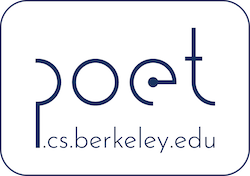

# POET
By Shishir G. Patil, Paras Jain, Prabal Dutta, Ion Stoica, and Joseph E. Gonzalez  ([Project Website](https://shishirpatil.github.io/poet/))



_See the paper!_ [https://arxiv.org/abs/2207.07697](https://arxiv.org/abs/2207.07697)

`POET` enables the training of state-of-the-art memory-hungry ML models on smartphones and other edge devices. POET (Private Optimal Energy Training) exploits the twin techniques of integrated tensor rematerialization, and paging-in/out of secondary storage \(as detailed in our paper at ICML 2022\) to optimize models for training with limited memory. POET's Mixed Integer Linear Formulation (MILP) ensures the solutions are provably optimal! 

With POET, we are the first to demonstrate how to train memory-hungry SOTA ML models such as BERT and 
ResNets on smartphones and tiny ARM Cortex-M devices :muscle:

Reach out to us at [sgp@berkeley.edu](mailto:sgp@berkeley.edu), if you have large models that you are trying to train - be it on GPUs, or your commodity edge devices such as laptops, smartphones, raspberry-pis, ARM Cortex M and A class, fitbits, etc.


## Get Started

POET OSS along with tutorials are coming soon..!


## Key ideas

From our [paper at ICML 2022](https://arxiv.org/abs/2207.07697):
```text
In this work, we show that paging and rematerialization are highly complementary. 
By carefully rematerializing cheap operations while paging results of expensive operations 
to auxiliary memory such as a flash or an SD card, we can scale effective memory capacity 
with minimal energy over- head. By combining these two methods, we demonstrate it is 
possible to train models like BERT on mobile-class edge devices. By framing edge training 
as an optimization problem, we discover optimal schedules with provable minimal energy 
consumption at a given memory budget. While the focus of this paper is edge deployments, 
the energy objective is increasingly becoming relevant even for cloud deployments!
```

## Citation

If you use POET in your work, please cite us with:

```text
@inproceedings{patil2022poet,
  title={POET: Training Neural Networks on Tiny Devices with Integrated Rematerialization and Paging},
  author={Patil, Shishir G and Jain, Paras and Dutta, Prabal and Stoica, Ion and Gonzalez, Joseph},
  booktitle={International Conference on Machine Learning},
  pages={17573--17583},
  year={2022},
  organization={PMLR}
}
```
